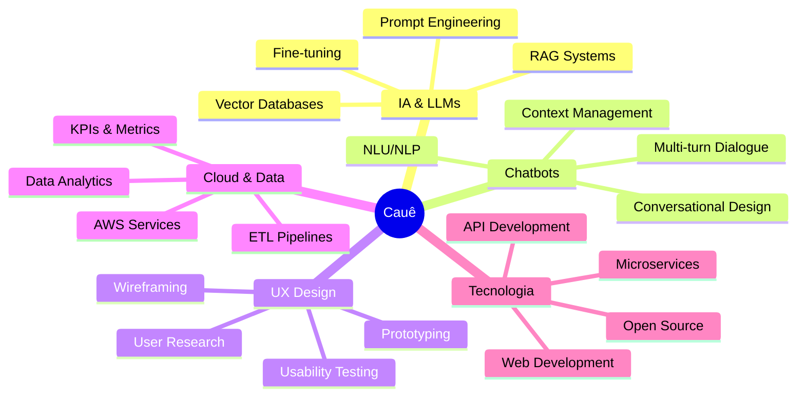

<div align="center">

# 👋 Olá, eu sou o Cauê Rodrigues

<a href="https://git.io/typing-svg"></a>
</div>

---

## 🤖 Sobre Mim

```python
class CauêRodrigues:
    def __init__(self):
        self.name = "Cauê Rodrigues"
        self.role = "Futuro Cientista da Computação"
        self.education = "Graduação iniciada em 2022"
        self.interests = [
            "Inteligência Artificial",
            "Large Language Models (LLMs)",
            "Chatbots & Conversational AI",
            "User Experience (UX)",
            "Cloud Computing & AWS",
            "Data Analytics & KPIs",
            "Prompt Engineering"
        ]
        self.learning = ["Machine Learning", "NLP", "RAG Systems", "Data Visualization"]
        self.contact = "cauraguiar@hotmail.com"
    
    def say_hi(self):
        print("Sempre aberto a colaborações e aprendizado! 🚀")

me = CauêRodrigues()
me.say_hi()
```

---

## 🧠 Áreas de Interesse & Tecnologias

### 🎯 Foco Principal

<div align="center">


</div>

### 🤖 IA & Machine Learning


### 💻 Linguagens & Ferramentas


### ☁️ Cloud & Infraestrutura


### 📊 Data & Analytics


---

## 💡 Projetos & Interesses


```mermaid
mindmap
  root((Cauê))
    IA & LLMs
      Prompt Engineering
      RAG Systems
      Fine-tuning
      Vector Databases
    Chatbots
      Conversational Design
      NLU/NLP
      Multi-turn Dialogue
      Context Management
    UX Design
      User Research
      Wireframing
      Prototyping
      Usability Testing
    Cloud & Data
      AWS Services
      Data Analytics
      KPIs & Metrics
      ETL Pipelines
    Tecnologia
      Open Source
      Web Development
      API Development
      Microservices
```

---

## 📫 Como me Encontrar

<div align="center">

[](mailto:cauaguiar@outlook.com.br)
[](https://github.com/CauAguiar)
[](https://www.linkedin.com/in/cauaguiar)

</div>

---

<div align="center">

### ⭐ Se você achou meu perfil interessante, deixe uma estrela em algum projeto!

<picture>
  <source media="(prefers-color-scheme: dark)" srcset="https://raw.githubusercontent.com/CauAguiar/CauAguiar/output/github-contribution-grid-snake-dark.svg">
  <source media="(prefers-color-scheme: light)" srcset="https://raw.githubusercontent.com/CauAguiar/CauAguiar/output/github-contribution-grid-snake.svg">
  
</picture>

<sub>💙 Feito com muito café ☕</sub>

</div>
